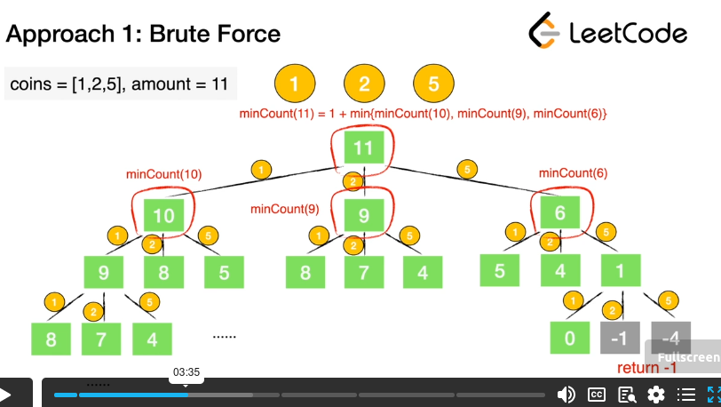

# Coin Change

[https://leetcode.com/problems/coin-change/](https://leetcode.com/problems/coin-change/)

## Strategy - Brute Force

* The idea is to think of coin choose as a decision tree branch
* When you choose a coin(go down one path), subtract that from the amount
* minCount(11) = 1(coin choice) + min(minCount(10),minCount(9),minCount(6))
*

    <figure><figcaption></figcaption></figure>


```java
public class CoinChangeBruteForce {
    public static void main(String[] args) {
        int[] coins = new int[]{1,2,5};
        int amount = 11;
        int res = recursion(coins, amount);
        System.out.println(res);
    }
    public static int recursion(int[] coins, int remain) {
        if (remain < 0) return -1;
        if (remain == 0) return 0;

        int minCount = Integer.MAX_VALUE;
        for (int coin : coins) {
            int count = recursion(coins, remain - coin);
            if (count == -1) continue;
            minCount = Math.min(minCount, count + 1);
        }

        return minCount == Integer.MAX_VALUE ? -1 : minCount;
    }
}

```

### Time/Space

* Time -> S^n -> Exponential to the amount of coins n
  * Every coin denomination could have at most S/coin values(amount of 1 count that could be used to make up sum)
* Space -> O(n) -> Depth of recursion in n


## Strategy - Dynamic Programming(Bottom Up)

```java
class Solution {
    public int coinChange(int[] coins, int amount) {
        if (amount < 0 || coins.length == 0 || coins == null) {
            return 0;
        }
        int[] dp = new int[amount + 1];
        Arrays.fill(dp, amount + 1);
        dp[0] = 0;
        
        for (int i = 1; i <= amount; i++) {
            for (int coin : coins) {
                if (i - coin >= 0) {// think of i - coin as remainder needed for solition at dp[i]
                    dp[i] = Math.min(dp[i], 1 + dp[i - coin]);
                }
            }
        }
        
        return dp[amount] != amount + 1 ? dp[amount] : -1;
        
    }
}
```
